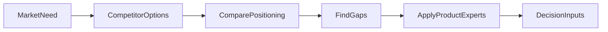

# Examples

## Example 1: Competitor Snapshot

```markdown
# AI Note Takers

## Executive Summary
- `Granola` and `Otter` both focus on meeting capture, but they package the value differently.
- `Granola` appears more focused on polished note quality and workflow fit for professionals.
- `Otter` appears broader, with stronger meeting assistant positioning and larger brand recognition.

## Comparison
| Company | ICP | Positioning | Pricing | Notes |
| --- | --- | --- | --- | --- |
| Granola | Professionals in meetings | Clean AI meeting notes inside desktop workflow | [Check current pricing page] | Strong UX signal |
| Otter | Teams and businesses | AI meeting assistant for notes and collaboration | [Check current pricing page] | Strong brand signal |

## Key Insights
- There may be room to differentiate on workflow depth rather than note generation alone. (`medium` confidence)

## Sources
| Source | Type | Date | Supports |
| --- | --- | --- | --- |
| Official pricing pages | `primary` | Current | Packaging and plan structure |
| Product pages | `primary` | Current | Positioning and feature claims |
```

## Example 2: Market Scan

```markdown
# Cloud GPU Developer Tools

## Executive Summary
- The category is crowded on infrastructure access but less consistent on onboarding quality and workflow integration.
- Many players look similar on paper, so positioning often shifts to speed, trust, and target persona.

## Comparison
| Company | Core value | Target user | Proof point | Confidence |
| --- | --- | --- | --- | --- |
| A | Fast setup | Solo developers | Official docs and user reviews | `medium` |
| B | Enterprise controls | Platform teams | Security docs and case studies | `high` |

## Unknowns
- Comparable activation metrics are rarely public.
- Some feature claims are repeated across SEO content without direct product proof.

## Sources
| Source | Type | Date | Supports |
| --- | --- | --- | --- |
| Official docs | `primary` | Current | Features and workflow |
| Analyst report | `trusted-secondary` | 2026-01-15 | Category framing |
```

## Example 3: Flow Diagram


