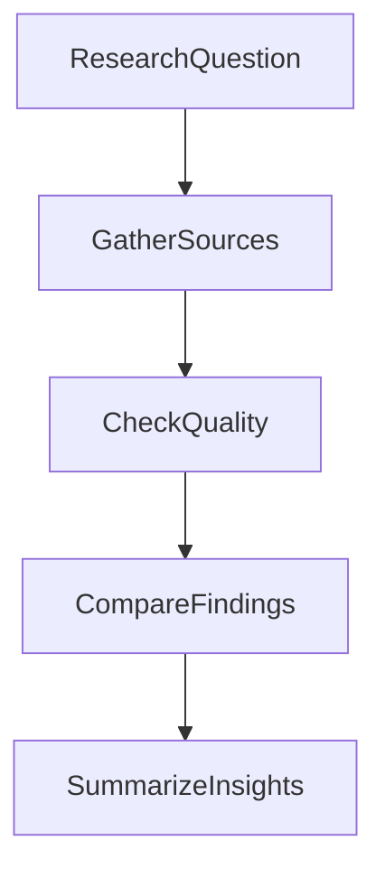

# Output Template

Pick the smallest template that fits the task.

## 1. Quick Scan

```markdown
# [Topic]

## Executive Summary
- [Main takeaway]
- [Main takeaway]
- [Main takeaway]

## Comparison
| Option | Who it serves | Strength | Weakness | Evidence note |
| --- | --- | --- | --- | --- |

## Key Insights
- [Insight] (`high` confidence)
- [Insight] (`medium` confidence)

## Unknowns
- [What is still unclear]

## Sources
| Source | Type | Date | Supports |
| --- | --- | --- | --- |
```

## 2. Competitor Comparison

```markdown
# [Competitor Set]

## Executive Summary
- [What matters most]

## Comparison
| Company | ICP | Positioning | Core features | Pricing | Go-to-market | Notable signal |
| --- | --- | --- | --- | --- | --- | --- |

## Key Insights
- [Pattern across competitors]
- [Gap or opportunity]

## Risks And Unknowns
- [Conflicting information]

## Sources
| Source | Type | Date | Supports |
| --- | --- | --- | --- |
```

## 3. Decision Memo Input

```markdown
# [Decision Topic]

## Executive Summary
- [What the evidence says]

## Facts
- [Verified fact]

## Inferences
- [Reasonable conclusion based on evidence]

## Unknowns
- [Missing proof or unresolved issue]

## Comparison
| Option | User value | Business value | Technical note | Evidence strength |
| --- | --- | --- | --- | --- |

## Product-Experts Interpretation
### Designer View
- [...]
### PM View
- [...]
### Engineering View
- [...]

## Sources
| Source | Type | Date | Supports |
| --- | --- | --- | --- |
```

## Diagram Template

Use only when structure is clearer as a flow:


